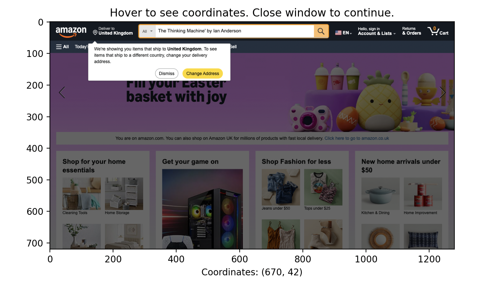
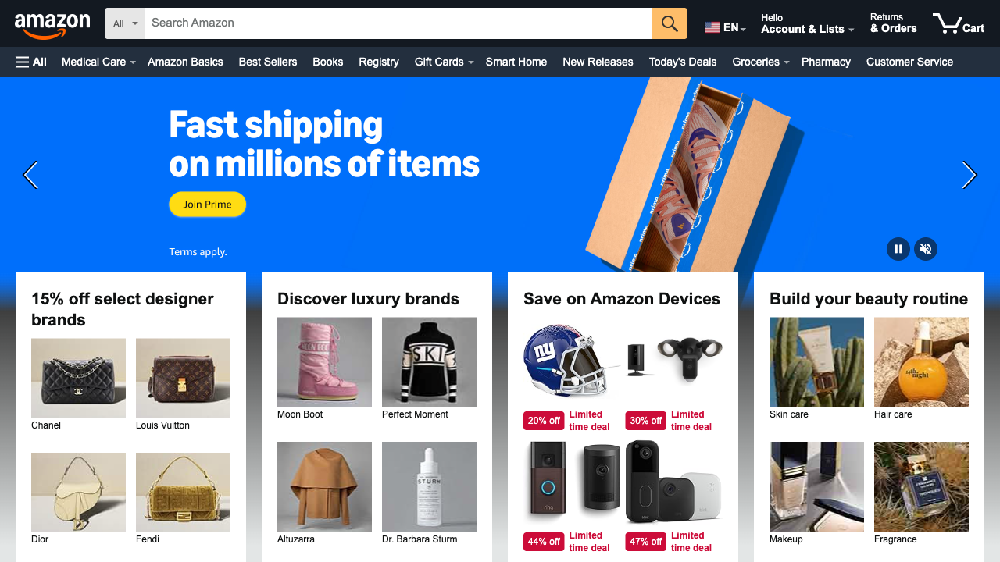
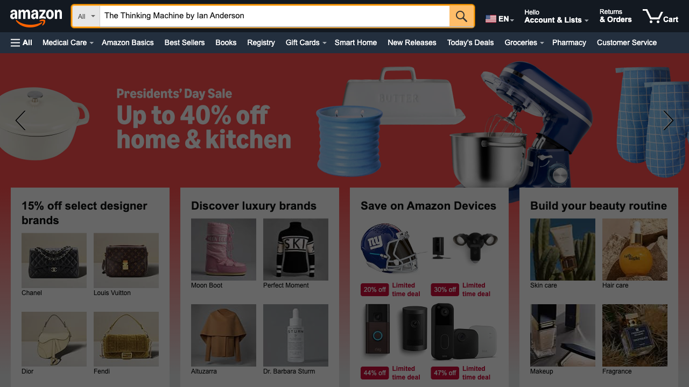
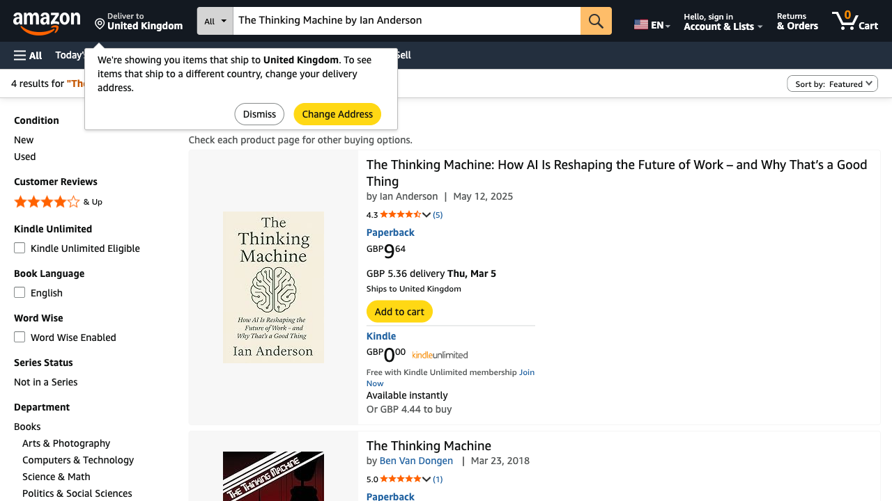
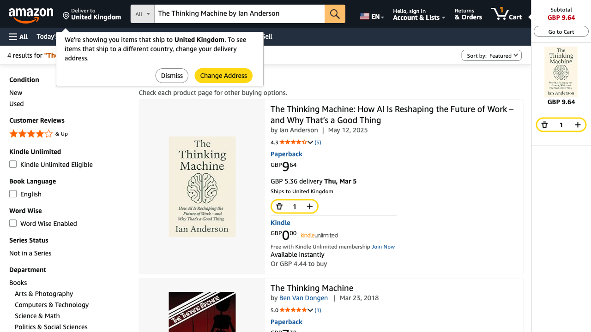

# Tiny Web Nav Agent

A minimal vision-based web navigation agent. An LLM looks at browser screenshots and decides what to do next (click, type, scroll, ...) until the task is done.

## How it works

1. The agent takes a screenshot of the browser
2. Sends it to a vision LLM (Qwen3 VL via OpenRouter by default)
3. The LLM reasons about what to do and returns an action (e.g. `Click(500, 300)`)
4. The agent executes the action in the browser and repeats

## Setup

```bash
pip install -r requirements.txt
playwright install chromium
export OPENROUTER_API_KEY="your-key-here"
```

## Usage

### Run the agent

```bash
cd .. && python -m tiny_web_nav_agent.run
```

You'll be prompted to enter a task. The agent runs autonomously and saves all results (screenshots, LLM responses, actions) to a `results/` directory when done.

### Interactive debugging mode

A manual testing mode where **you** play the role of the LLM. A matplotlib window shows the current screenshot with **live coordinate tracking on hover**, so you can figure out exact coordinates before typing your action.

```bash
cd .. && python -m tiny_web_nav_agent.interactive
```



### Run tests

```bash
cd .. && python -m unittest tiny_web_nav_agent.tests.test_agent
```

## Swapping the LLM

Edit `llm.py`. The interface is a single function: `list[dict] → str`. Any OpenAI-compatible API works. The default uses Qwen3 VL 235B A22B Instruct via OpenRouter, which is trained on GUI grounding and works well with coordinate-based actions.

## Example trajectory from Qwen3 VL 235B A22B Instruct (first attempt)

> **Task:** *"Add to cart the book 'The Thinking Machine' by Ian Anderson on Amazon."*

**Step 0** — Agent sees the Amazon homepage, clicks the search bar.



> *"I need to search for the book 'The Thinking Machine' by Ian Anderson. The search bar is visible at the top of the page, so I should click on it."*
>
> `Click(250, 41)`

**Step 1** — Search bar is focused, types the search query.


> *"The search bar is now focused, and I need to type the book title."*
>
> `Type(The Thinking Machine by Ian Anderson)`

**Step 2** — Presses Enter to search.



> *"I have entered the search query. To proceed, I need to execute the search."*
>
> `Press(Enter)`

**Step 3** — Finds the book in search results and clicks "Add to Cart".



> *"I have found the book in the search results. The 'Add to cart' button is visible next to the book listing."*
>
> `Click(450, 616)`

**Step 4** — Confirms the book was added to the cart. Done.



> *"The book has been successfully added to the cart, as indicated by the cart icon showing a quantity of 1."*
>
> `Finished()`

5 steps fully autonomous.

## Project structure

```
├── agent.py          # Core agent loop, action parsing, system prompt
├── browser.py        # Playwright browser wrapper
├── llm.py            # LLM API call (swap this to change models)
├── run.py            # Entry point for autonomous runs
├── interactive.py    # Manual debugging mode with coordinate overlay
├── save_results.py   # Saves screenshots + trajectory to results/
└── tests/
    └── test_agent.py
```
